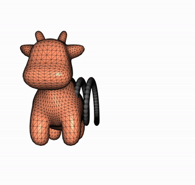
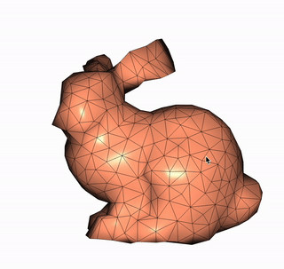
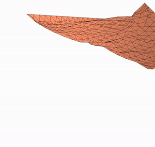
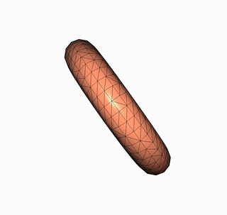
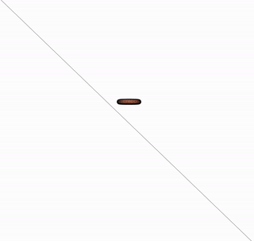

# CSC417-homeworks

This repository is the collection of notes and homeworks based on the course [CSC417-physics-based animation](https://github.com/dilevin/CSC417-physics-based-animation)

## build

```shell
mkdir build && cd build
cmake .. -DCMAKE_BUILD_TYPE=Release
make
cd build
```

- [mass-spring-1D](./a1-mass-spring-1d/README.md)  
  

```
cd a1-mass-spring-1d
```

```shell
./mass-spring-1d
```

```shell
./mass-spring-1d 'rk'
```

```shell
./mass-spring-1d 'be'
```

```shell
./mass-spring-1d 'se'
```

- [mass-spring-3d](./a2-mass-spring-3d/README.md)  
  

```shell
cd a2-mass-spring-3d
./mass-spring-3d
```

- [FEM-3D](./a3-finite-elements-3d/README.md)  
  

```shell
cd a3-finite-element-3d
./finite-elements-3d
```

- [FEM-Cloth-Simulation](./a4-cloth-simulation/README.md)  
  

```shell
cd a4-cloth-simulation
./cloth-simulation
```

- [Rigid Bodies](./a5-rigid-bodies/README.md)  
  

```shell
cd a5-rigid-bodies
./rigid-bodies
```

- [Rigid Bodies Collision](./a6-rigid-bodies-contact/README.md)  
  

```shell
cd a6-rigid-bodies-contact
./a6-rigid-bodies-contact
```
