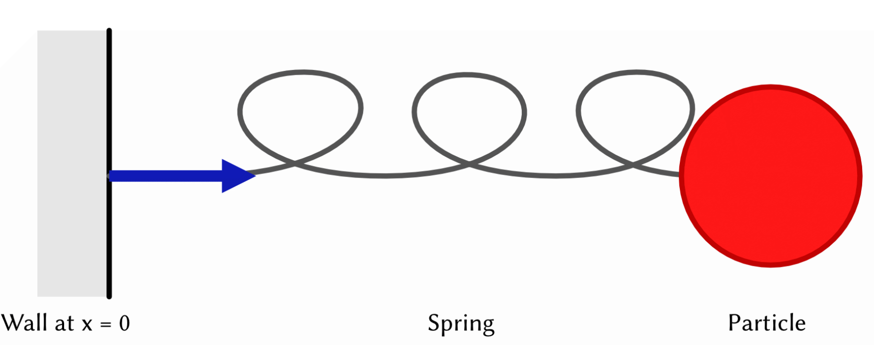
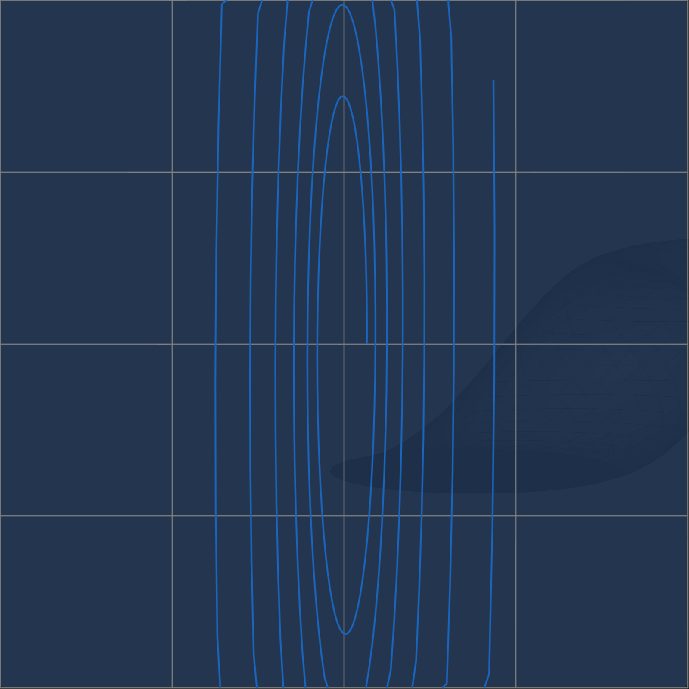
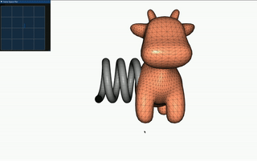
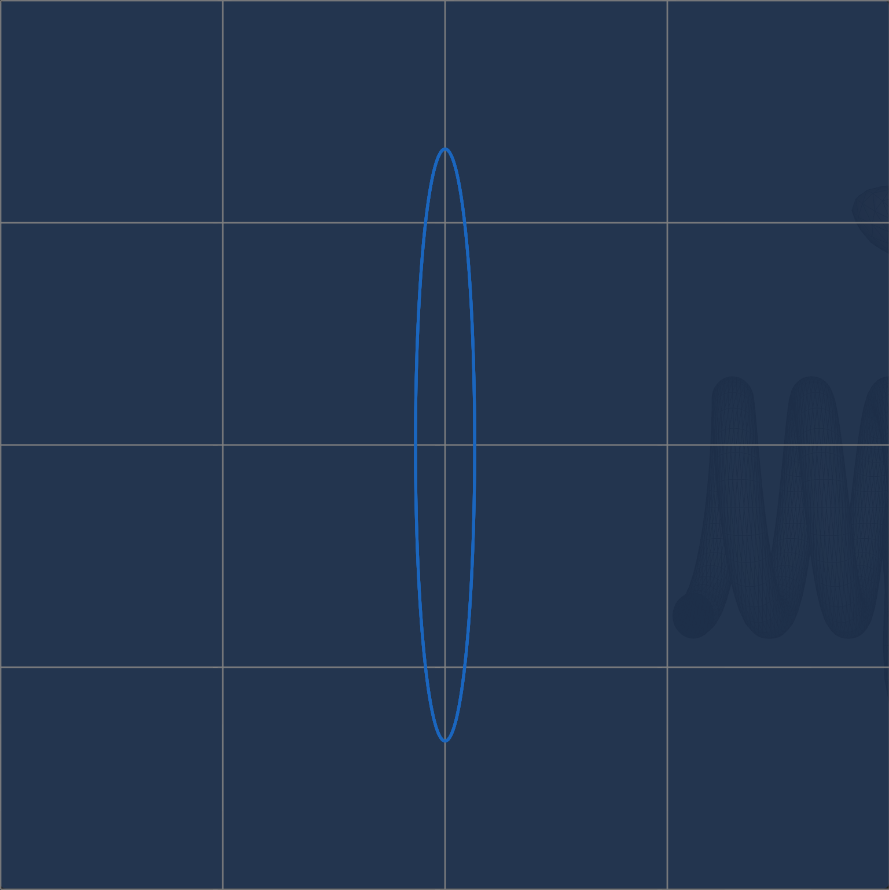
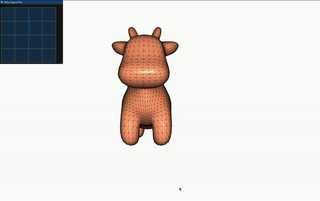
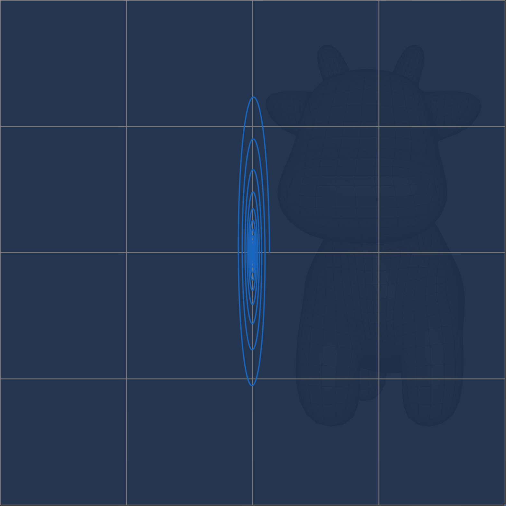
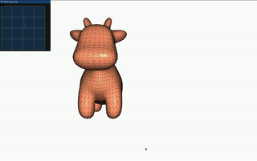
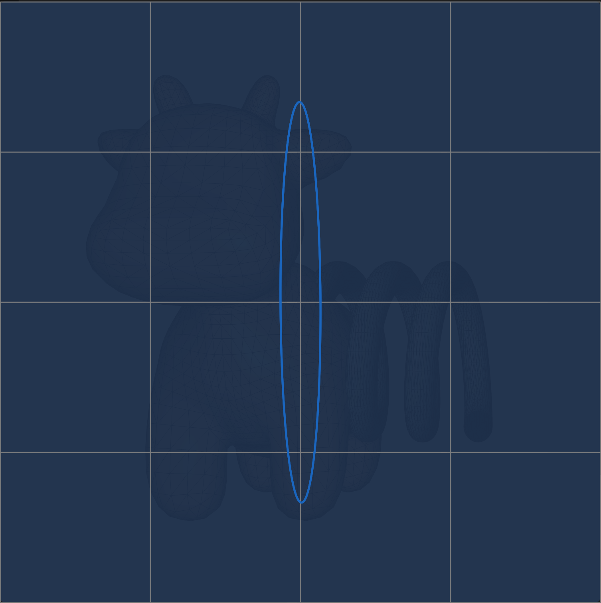
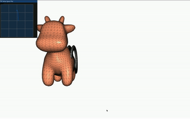

# Time Integration of Mass Spring Systems in One Dimension

## Background

Mass Spring System:

<div style="display: flex; justify-content: center;">

</div>

$$
q = x(t) \\
\dot q = v(t)
$$

Kinetic Energy in 1D:
$$T = \frac{1}{2}mv^2$$

The potential energy of the spring system:

$$
V = \frac{1}{2}kx^2
$$

The Euler Lagrange Equations:

$$
L = T - V = \frac{1}{2}m\dot q^2 - \frac{1}{2}kq^2 \\
$$

$$
\frac{d}{dt}\frac{\partial L}{\partial \dot q} = \frac{\partial L}{\partial q} \\
$$

$$
\frac{d}{dt}\frac{\partial L}{\partial \dot q} = \frac{d}{dt}(m\dot q) \\
$$

$$
\frac{\partial L}{\partial q} = -kq \\
$$

$$
\frac{d}{dt}(m\dot q) = -kq \\
$$

$$
m\ddot q = -kq
$$

### How to solve $m\ddot q = -kq$?

The coupled Fisrt Order System:

$$
m\ddot q = - kq \\
\dot q = v \\
m\dot v = -kq
$$

Rewrite in matrix form:

$$
\begin{pmatrix}
m & 0 \\
0 & 1 \\
\end{pmatrix} \frac{d}{dt} \begin{pmatrix}
v \\
q \\
\end{pmatrix} = \begin{pmatrix}
0 & -k \\
1 & 0 \\
\end{pmatrix}\begin{pmatrix}
v \\
q \\
\end{pmatrix}
$$

$1^{st}$ Order ODE:

$$
A\dot y = f(y) \\
$$

$$
y = \begin{pmatrix}
v \\
q \\
\end{pmatrix}
$$

### Attempt #1: Forward Euler Integration

$$
A\dot y = f(y) \\
$$

$$
\dot y \approx \frac{1}{\Delta t}(y ^{t + 1} - y^t)
$$

$$
A\frac{1}{\Delta t}(y ^{t + 1} - y^t) = f(y^t)
$$

$$
v^{t+1} = v^t - \Delta t \frac{k}{m} q^t
$$

$$
q^{t+1} = q^t + \Delta t v^t
$$

In [`include/forward_euler.h`](./include/forward_euler.h):

```cpp
q = q + dt * qdot;
qdot = qdot + dt * f / mass; // f = -k*q
```

**Phase-Space**

<div style="display: flex; justify-content: center;">

</div>

**Result**

<div style="display: flex; justify-content: center;">

</div>

### Attempt #2: Runge-Kutta Integration

$$
\kappa_1 = A^{-1}f(y^t)
$$

$$
\kappa_2 = A^{-1}f(y^t + \frac{\Delta t}{2}\cdot \kappa_1)
$$

$$
\kappa_3 = A^{-1}f(y^t + \frac{\Delta t}{2}\cdot \kappa_3)
$$

$$
\kappa_4 = A^{-1}f(y^t + \Delta t\cdot \kappa_3)
$$

$$
y^{t+1} = y^t + \frac{\Delta t}{6}(\kappa_1 + 2 \cdot \kappa_2 + 2 \cdot \kappa_3 + \kappa_4)
$$

In [`include/runge_kutta.h`](./include/runge_kutta.h):

```cpp
Eigen::VectorXd f1, f2, f3, f4;
Eigen::VectorXd q1 = q;
Eigen::VectorXd qdot1 = qdot;
force(f1, q1, qdot1);
Eigen::VectorXd q2 = q + dt * qdot1 / 2;
Eigen::VectorXd qdot2 = qdot + dt * f1 / mass / 2;
force(f2, q2, qdot2);
Eigen::VectorXd q3 = q + dt * qdot2 / 2;
Eigen::VectorXd qdot3 = qdot + dt * f2 / mass / 2;
force(f3, q3, qdot3);
Eigen::VectorXd q4 = q + dt * qdot3;
Eigen::VectorXd qdot4 = qdot + dt * f3 / mass;
force(f4, q4, qdot4);
q = q + dt * (qdot1 + 2 * qdot2 + 2 * qdot3 + qdot4) / 6;
qdot = dt * (f1 + 2 * f2 + 2 * f3 + f4) / 6 / mass + qdot;
```

**Phase-Space**

<div style="display: flex; justify-content: center;">

</div>

**Result**

<div style="display: flex; justify-content: center;">

</div>

### Attempt #3: Backward Integration

$$
A \dot y = f(y) = By
$$

$$
A\frac{1}{\Delta t}(y^{t+1} - y^t) = B y^{t+1}
$$

$$
(I - \Delta t A^{-1}B)y^{t+1} = y^t
$$

$$
(1 + \Delta t^2 \frac{k}{m})v^{t+1} = v^t - \Delta t\frac{k}{m} q^t
$$

$$
q^{t+1} = q^t + \Delta t v^{t+1}
$$

In [`include/backward_euler.h`](./include/backward_euler.h):

```cpp
qdot = (qdot + dt * f / mass) / (1 - dt * dt * k(0, 0) / mass);
q = q + dt * qdot;
```

**Phase-Space**

<div style="display: flex; justify-content: center;">

</div>

**Result**

<div style="display: flex; justify-content: center;">

</div>

### Attempt #4: Symplectic Euler Integration

$$
v^{t+1} = v^t - \Delta t\frac{k}{m} q^t
$$

$$
q^{t+1} = q^t + \Delta t v^{t+1}
$$

In [`include/symplectic_euler.h`](./include/symplectic_euler.h):

```cpp
qdot = qdot + dt * f / mass;
q = q + dt * qdot;
```

**Phase-Space**

<div style="display: flex; justify-content: center;">

</div>

**Result**

<div style="display: flex; justify-content: center;">

</div>

**Derivatives**

In [`src/dV_spring_particle_particle_dq.cpp`](./src/dV_spring_particle_particle_dq.cpp):

$$
\frac{dV}{dq} = kx
$$

```cpp
dV.resize(1);
dV = stiffness * q;
```

In [`src/d2V_spring_particle_particle_dq2.cpp`](./src/d2V_spring_particle_particle_dq2.cpp):

$$
\frac{dV^2}{d^2q} = k
$$

```cpp
H.resize(1, 1);
H << stiffness;
```
