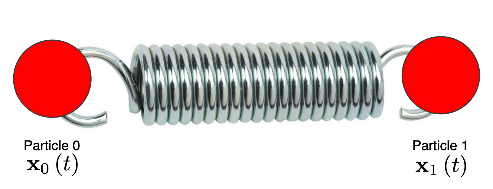
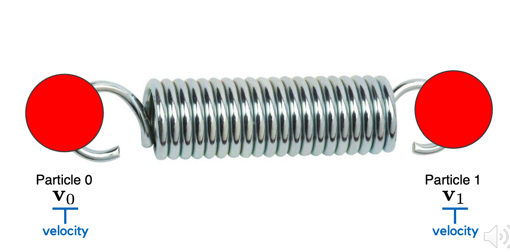
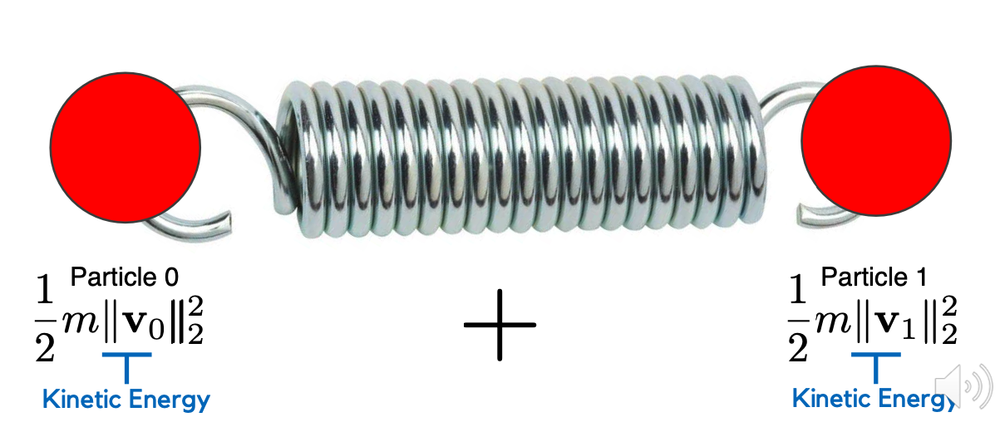
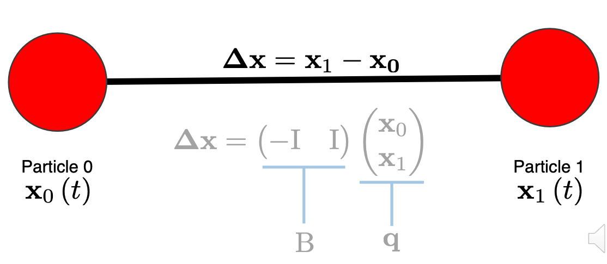

# Time Integration of Mass Spring Systems in One Dimension

## Background

Mass-Spring-3D:

<div style="display: flex; justify-content: center;">

</div>
<div style="display: flex; justify-content: center;">

</div>

Kinetic Energy:

<div style="display: flex; justify-content: center;">

</div>

Total Kinetic Energy:

$$
\sum_{i=0}^1 \frac{1}{2}m||v_i||_2^2 = \sum_{i=0}^1 \frac{1}{2}mv_i^Tv_i
$$

$$
\sum_{i=0}^1 \frac{1}{2}v_i^T\begin{pmatrix}
m & 0 & 0 \\
0 & m & 0 \\
0 & 0 & m
\end{pmatrix}
v_i
$$

$$
q = \begin{pmatrix}
x_0 \\ x_1
\end{pmatrix}
$$

$$
\dot q = \begin{pmatrix}
\dot x_0 \\ \dot x_1
\end{pmatrix} = \begin{pmatrix}
v_0 \\ v_1
\end{pmatrix}
$$

Total Kinetic Energy:

$$
\sum_{i=0}^1 \frac{1}{2}v_i^TM_iv_i = \frac{1}{2}\dot q^T M \dot q
$$

$$
M = \begin{pmatrix}
M_0 & 0 \\ 0 & M_1
\end{pmatrix}
$$

Potential Energy for a 3D Spring:

- Undeformed length: $l_0$
- Deformed length: $l$
- Strain: $l - l_0$
- Stiffness Parameter: $k$
- Potential Energy: $\frac{1}{2}k(l - l_0)^2$
<div style="display: flex; justify-content: center;">

</div>

$$
l = \sqrt{\Delta x^T\Delta x} = \sqrt{q^TB^TBq}
$$

Potential Energy:

$$
V(q) = \frac{1}{2}k(\sqrt{q^TB^TBq} - l_0)^2
$$

Euler-Lagrange Equation:

$$
L = T - V
$$

$$
T = \frac{1}{2}\dot q^T M \dot q
$$

$$
V = \frac{1}{2}k(\sqrt{q^TB^TBq} - l_0)^2
$$

$$
\frac{d}{dt}\frac{\partial L}{\partial \dot q} = -\frac{\partial L}{\partial q}
$$

Equation of Motion:

$$
M\ddot q = -\frac{\partial V}{\partial q}
$$

Mass-Spring System:

## Implementation Notes

[`src/T_particle.cpp`](./src/T_particle.cpp)
Compute the kinetic energy of a single mass particle.

$$
T = \frac{1}{2}mv^2
$$

```cpp
T = mass * qdot.dot(qdot) / 2.;
```

[`src/V_gravity_particle.cpp`](./src/V_gravity_particle.cpp)
Compute the gravitational potential energy of a single mass particle.

$$
V = mgh
$$

```cpp
V = mass * std::abs(g.dot(q));
```

[`src/V_spring_particle_particle.cpp`](./src/V_spring_particle_particle.cpp)
Compute the potential energy of a spring which connects two particles.

$$
V = \frac{1}{2}k(||q_1 - q_0|| - l_0)^2
$$

```cpp
double norm_diff = (q1 - q0).norm() - l0;
V = 0.5 * stiffness * norm_diff * norm_diff;
```

[`src/dV_gravity_particle_dq.cpp`](./src/dV_gravity_particle_dq.cpp)
Compute the gradient of the gravitational potential energy for a single particle.

$$
f = \frac{dV}{dq} = mg
$$

```cpp
f = mass * g;
```

[`src/dV_spring_particle_particle_dq.cpp`](./src/dV_spring_particle_particle_dq.cpp)
Compute the forces exerted by a single spring on its end-points.

$$
V = \frac{1}{2}k(||q_1 - q_0|| - l_0)^2
$$

$$
\frac{dV}{dq_0} = -k(||q_1 - q_0|| - l_0)\frac{q_1 - q_0}{||q_1 - q_0||}
$$

$$
\frac{dV}{dq_1} = k(||q_1 - q_0|| - l_0)\frac{q_1 - q_0}{||q_1 - q_0||}
$$

```cpp
 // compute the spring direction（q1 - q0）
Eigen::Vector3d delta_q = q1 - q0;

// compute the spring length ||q1 - q0||
double norm_delta_q = delta_q.norm();

// compute the magnitude of force k * (||q1 - 10|| - l0)
double force_magnitude = stiffness * (norm_delta_q - l0);

// Calculate the component of the force on each node
Eigen::Vector3d force = force_magnitude * (delta_q / norm_delta_q);

// construct the force
f.head(3) = -force; // 对 q0 的梯度
f.tail(3) = force;  // 对 q1 的梯度
```

[`src/d2V_spring_particle_particle_dq2.cpp`](./src/d2V_spring_particle_particle_dq2.cpp)
Compute the per-spring hessian of the spring potential energy.

$$
\frac{\partial V}{\partial q_{0i} q_{0j}} = \frac{\partial V}{\partial q_{1i} q_{1j}} = k * (1 - \frac{l_0}{||\Delta q||}) * \delta_{i,j} + k * l_0 \frac{\Delta q_i\Delta q_j} {||\Delta q||^3}
$$

$$
\frac{\partial V}{\partial q_{0i} q_{1j}} = \frac{\partial V}{\partial q_{1i} q_{0j}} = -(k * (1 - \frac{l_0}{||\Delta q||}) * \delta_{i,j} + k * l_0 \frac{\Delta q_i\Delta q_j} {||\Delta q||^3})
$$

$$
\delta_{i, j} = \begin{cases}
1, & \text{ } i = j\\
0, & \text{ } i \neq j
\end{cases}
$$

$$
\Delta q = q_1 - q_0
$$

```cpp
H.setZero();

Eigen::Vector3d delta_q = q1 - q0;
double norm_delta_q = delta_q.norm();
double norm_delta_q_cubic = norm_delta_q * norm_delta_q * norm_delta_q;

for (int i = 0; i < 6; i++)
{
    for (int j = i; j < 6; j++)
    {

        H(i, j) = delta_q[i % 3] * delta_q[j % 3] * l0 / norm_delta_q_cubic;
        if (i == j)
        {
            H(i, j) += (1 - l0 / norm_delta_q);
        }
        else if (i / 3 < 1 && j / 3 > 0)
        {
            H(i, j) = -H(i, j);
        }
        if (i != j)
        {
            H(j, i) = H(i, j);
        }
    }
}

H *= stiffness;
```

[`src/mass_matrix_particles.cpp`](./src/mass_matrix_particles.cpp)
Compute the sparse, diagonal mass matrix that stores the mass of each particle in the mass-spring on its diagonal.

$$
M = \begin{pmatrix}
M_1 & \cdots & 0 \\
\vdots & \ddots & \vdots \\
0 & \cdots & M_n
\end{pmatrix}
$$

$$
M_i = \begin{pmatrix}
m_i & 0 & 0 \\
0 & m_i & 0 \\
0 & 0 & m_i
\end{pmatrix}
$$

```cpp
M.resize(q.size(), q.size());
M.setIdentity();
M = mass * M;
```

[`src/assemble_forces.cpp`](./src/assemble_forces.cpp)

Iterate through each spring in the mesh, compute the per-spring forces and assemble the global force vector.

$$
f = \begin{pmatrix}
f_1 \\
f_2 \\
\vdots \\
f_n
\end{pmatrix}
$$

for Edge `AB`, the spring force $f$

$$
f_j = \begin{pmatrix}
f_A \\
f_B \\
\end{pmatrix} = E_j^T f
$$

```cpp
f.resize(q.size());
f.setZero();

for (int spring_i = 0; spring_i < E.rows(); spring_i++)
{
    Eigen::Vector3d q0 = q.segment<3>(3 * E(spring_i, 0));
    Eigen::Vector3d q1 = q.segment<3>(3 * E(spring_i, 1));
    Eigen::Vector6d f_spring_i;
    dV_spring_particle_particle_dq(f_spring_i, q0, q1, l0(spring_i), k);
    f.segment<3>(3 * E(spring_i, 0)) -= f_spring_i.head<3>();
    f.segment<3>(3 * E(spring_i, 1)) -= f_spring_i.tail<3>();
}
```

[`/src/assemble_stiffness.cpp`](./src/assemble_stiffness.cpp)

Iterate through each spring in the mesh, compute the per-spring stiffness matrix and assemble the global, sparse stiffness matrix. To do this, you should construct a list of Eigen::Triplet objects and then set your sparse matrix using these triplets.

$$
H = \begin{pmatrix}
d(q_{0x}q_{0x}) & d(q_{0x}q_{0y}) & d(q_{0x}q_{0z}) & d(q_{0x}q_{1x}) & d(q_{0x}q_{1y}) & d(q_{0x}q_{1z}) \\
d(q_{0y}q_{0x}) & d(q_{0y}q_{0y}) & d(q_{0y}q_{0z}) & d(q_{0y}q_{1x}) & d(q_{0y}q_{1y}) & d(q_{0y}q_{1z}) \\
d(q_{0z}q_{0x}) & d(q_{0z}q_{0y}) & d(q_{0z}q_{0z}) & d(q_{0z}q_{1x}) & d(q_{0z}q_{1y}) & d(q_{0z}q_{1z}) \\

d(q_{1x}q_{0x}) & d(q_{1x}q_{0y}) & d(q_{1x}q_{0z}) & d(q_{1x}q_{1x}) & d(q_{1x}q_{1y}) & d(q_{1x}q_{1z}) \\
d(q_{1y}q_{0x}) & d(q_{1y}q_{0y}) & d(q_{1y}q_{0z}) & d(q_{1y}q_{1x}) & d(q_{1y}q_{1y}) & d(q_{1y}q_{1z}) \\
d(q_{1z}q_{0x}) & d(q_{1z}q_{0y}) & d(q_{1z}q_{0z}) & d(q_{1z}q_{1x}) & d(q_{1z}q_{1y}) & d(q_{1z}q_{1z}) \\
\end{pmatrix}
$$

$$
K_j = \begin{pmatrix}
K_{AA} & K_{AB} \\
K_{AB}^T & K_{BB}
\end{pmatrix} =  \frac{\partial f}{\partial q} = - \frac{\partial ^2V}{\partial q^2}  =-H
$$

```cpp
K.resize(q.size(), q.size());
K.setZero();
Eigen::Matrix66d spring_i_H;
std::vector<Eigen::Triplet<double>> K_entries;
int q0_index, q1_index;
for (int spring_i = 0; spring_i < E.rows(); spring_i++)
{
    q0_index = 3 * E(spring_i, 0);
    q1_index = 3 * E(spring_i, 1);
    Eigen::Vector3d q0 = q.segment<3>(q0_index);
    Eigen::Vector3d q1 = q.segment<3>(q1_index);
    d2V_spring_particle_particle_dq2(spring_i_H, q0, q1, l0(spring_i), k);
    for (int i = 0; i < 3; i++)
    {
        for (int j = 0; j < 3; j++)
        {
            K_entries.push_back(Eigen::Triplet<double>(q0_index + i, q0_index + j, -spring_i_H(i, j)));
            K_entries.push_back(Eigen::Triplet<double>(q0_index + i, q1_index + j, -spring_i_H(i, j + 3)));
            K_entries.push_back(Eigen::Triplet<double>(q1_index + i, q0_index + j, -spring_i_H(i + 3, j)));
            K_entries.push_back(Eigen::Triplet<double>(q1_index + i, q1_index + j, -spring_i_H(i + 3, j + 3)));
        }
    }
}

K.setFromTriplets(K_entries.begin(), K_entries.end());
```

[`src/fixed_point_constraints.cpp`](./src/fixed_point_constraints.cpp)

Compute the sparse projection matrix which projects out fixed point vertices.

Fixed points:

$$
q_i = b_i
$$

$$
\hat q = P q
$$

$P$: selection matrix that selects NON-FIXED points

$$
P^T \hat q = \begin{pmatrix}
x_0 \\
x_1 \\
x_2 \\
0 \\
\vdots \\
x_n
\end{pmatrix} \text{ } b = \begin{pmatrix}
0 \\
0 \\
0 \\
b_i \\
\vdots \\
0
\end{pmatrix}
$$

$$
q = P^T \hat q + b
$$

```cpp
P.setZero();
P.resize(q_size - indices.size() * 3, q_size);
P.reserve(q_size - indices.size() * 3);

int current_row = 0;
for (int i = 0; i < q_size / 3; i++)
{
    // if not in indices
    if (std::find(indices.begin(), indices.end(), i) == indices.end())
    {
        for (int j = 0; j < 3; j++)
        {
            P.insert(current_row, i * 3 + j) = 1;
            current_row++;
        }
    }
}

```

[`src/pick_nearest_vertices.cpp`](./src/pick_nearest_vertices.cpp)

```cpp
double min_vertex = V(0, 1);

for (unsigned int vi = 0; vi < V.rows(); vi++)
{
    min_vertex = (V(vi, 1) < min_vertex ? V(vi, 1) : min_vertex);
}

std::cout << min_vertex << std::endl;

for (unsigned int vi = 0; vi < V.rows(); vi++)
{
    if (std::abs(V(vi, 1) - min_vertex) <= tol)
    {
        indices.push_back(vi);
    }
}
```

[`include/linearly_implicit_euler.h`](./include/linearly_implicit_euler.h)

$$
M\ddot q = f
$$

Backward Euler:

$$
M \dot q^{t+1} = M\dot q^t + \Delta t f(q^{t+1}) \\
q^{t+1} = q^t + \Delta t \dot q^{t+1}
$$

$$
M \dot q^{t+1} = M\dot q^t + \Delta t f(q^t + \Delta t \dot q^{t+1}) \\
q^{t+1} = q^t + \Delta t \dot q^{t+1}
$$

$$
M \dot q^{t+1} = M\dot q^t + \Delta t f(q^t) + \Delta t^2 \frac{\partial f}{\partial q} \dot q^{t+1} \\
q^{t+1} = q^t + \Delta t \dot q^{t+1}
$$

$$
K = \frac{\partial f}{\partial q}
$$

$$
(M - \Delta t^2 K) \dot q^{t+1} = M\dot q^t + \Delta t f(q^t) \\
q^{t+1} = q^t + \Delta t \dot q^{t+1}
$$

```cpp
// Eigen::SimplicialLDLT is a class in the Eigen library for solving sparse matrices, using LDLT decomposition
Eigen::SimplicialLDLT<Eigen::SparseMatrix<double>> solver;
// compute the stiffness k
stiffness(tmp_stiffness, q, qdot);
// compute the force f
force(tmp_force, q, qdot);
// construct the coefficient matrix of the linear equation system
solver.compute(mass - dt * dt * tmp_stiffness);
// solve the system of linear equations to get the generalized velocity qdot for the next time step
qdot = solver.solve(mass * qdot + dt * tmp_force);
q = q + dt * qdot;
```

**Simulate**:

$$
q =  P^T \hat q + b
$$

$$
b = q - P^T \hat q = q - P^T P q
$$

```cpp
x0 = q - P.transpose() * P * q;
```

$$
q = P q \\
\dot q = P \dot q \\
$$

```cpp
// correct M, q, and qdot so they are the right size
q = P * q;
qdot = P * qdot;

```

$$
(M - \Delta t^2 K) \dot q^{t+1} = M\dot q^t + \Delta t f(q^t) \\
q^{t+1} = q^t + \Delta t \dot q^{t+1}
$$

$$
P(M - \Delta t^2 K)P^T \dot {\hat q}^{t+1} = P M\dot q^t + \Delta t P f(q^t) \\
q^{t+1} = q^t + \Delta t p^T \hat { \dot q}^{t+1}
$$

```cpp
M = P * M * P.transpose();
f = P * f;
K = P * K * P.transpose();
```
