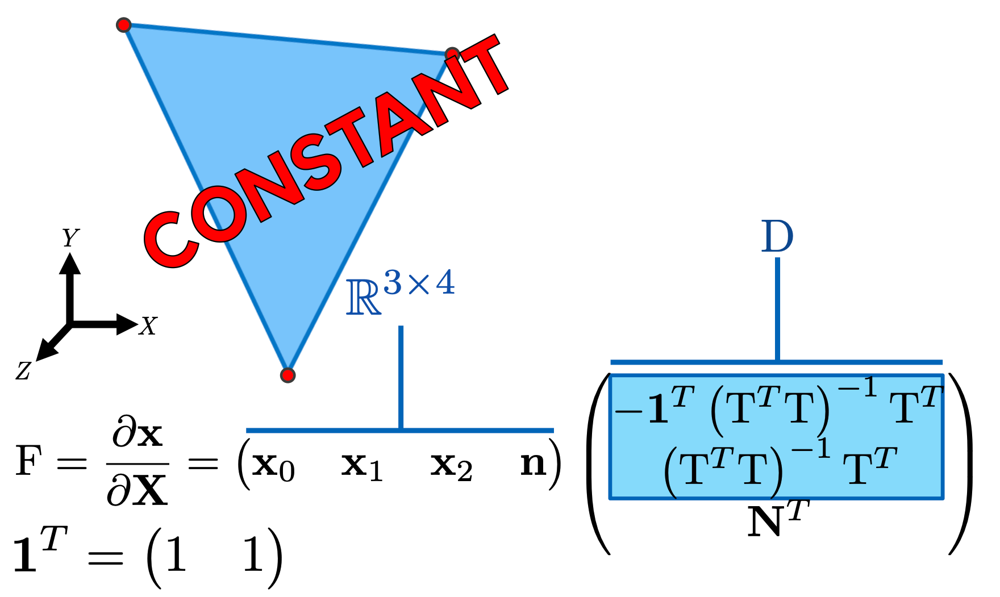
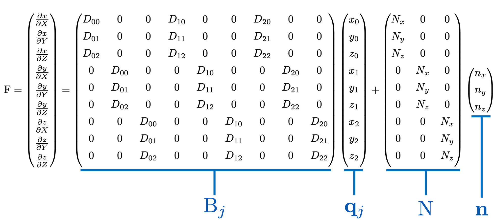
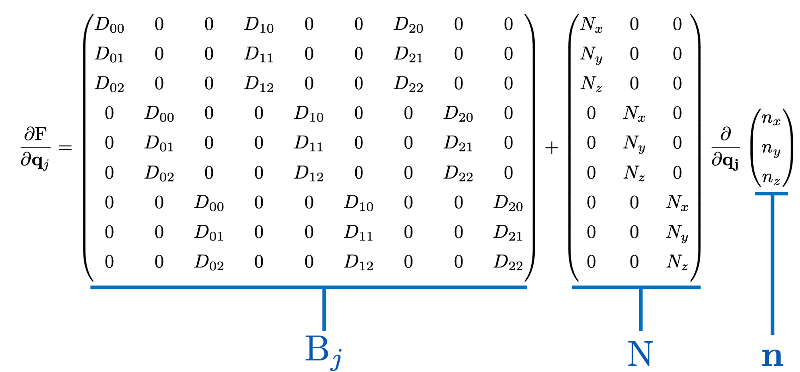
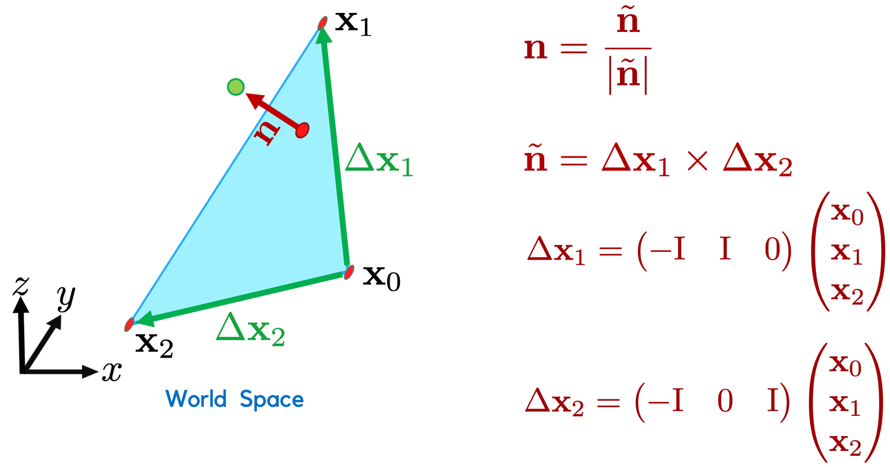
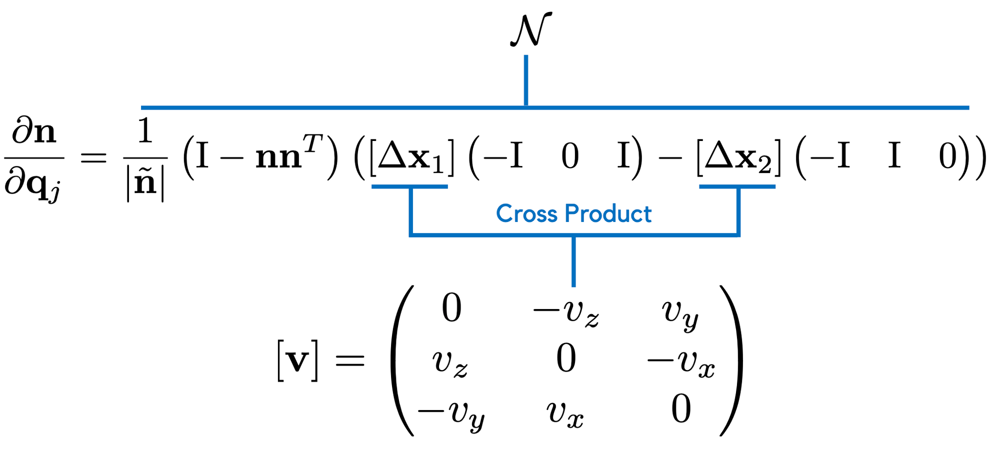
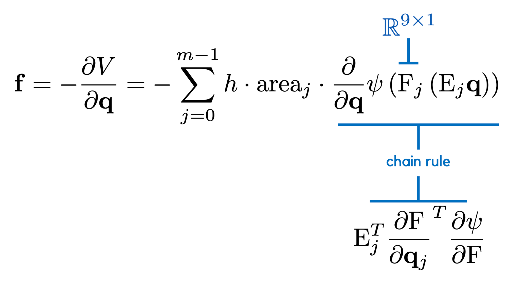
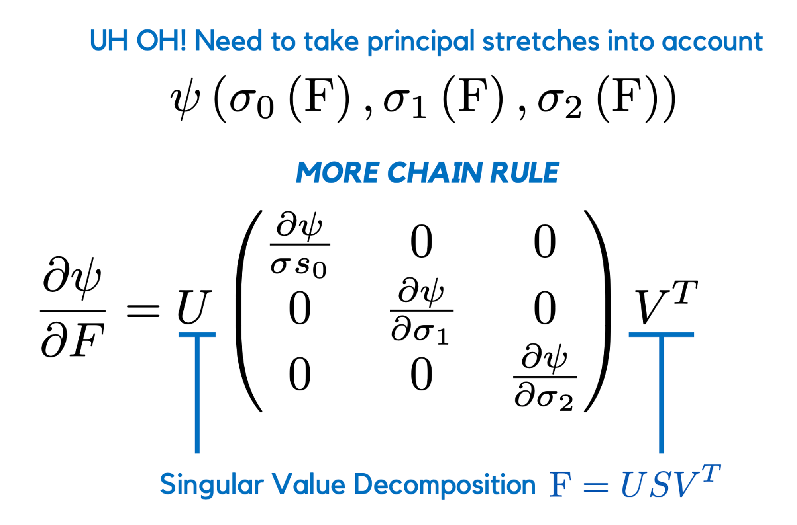
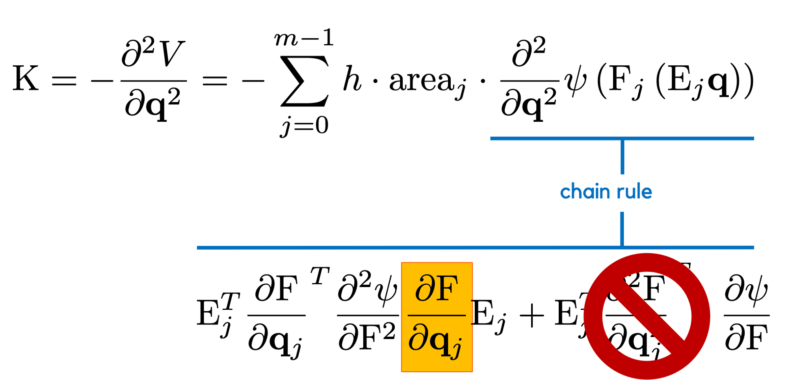

## Background

### Generalized Coordinates and Velocities

First, choose basis, or shape functions with which to approxiamte functions on triangular mesh. A trianle as 3 nodes the approximations become:

$$
f(\mathbf Y) = \sum_{i=0}^2 f_i \phi_i(\mathbf Y)
$$

where $\phi_i$ are the `barycentric coordinates` for a 2D triangle and $\mathbf Y \in \R^2$ is the 2D coordinate in the undeformed space.

However, cloth is really a thin volumetric construct, of which our triangle only represents a small part. We might need information lying slightly off the triangle surface. To account for this we will need to modify our FEM model a bit. First, let's assume our triangle is actually embedded in a 3D undeformed space $\mathbf X \in \R^3$ . Let's try and and build and appropriate mapping from this space to the world space.

Given any point $\mathbf X$ in the undeformed space, we can compute the barycentric coordinates of the nearest point on our triangle by solving

$$
\begin{bmatrix}
\phi_1(\mathbf X) \\
\phi_2(\mathbf X)
\end{bmatrix} = (T^TT)^{-1}T^T(\mathbf X - \mathbf X_0)
$$

where $T = \begin{bmatrix}(\mathbf X_1 - \mathbf X_0)& (\mathbf X_2 - \mathbf X_0)]\end{bmatrix}$ is a matrix of edge vectors. We use the constraint $\phi_0 + \phi_1 + \phi_2 = 1$ to reconstruct $\phi_0$. This equation finds the barycentric coordinates of the nearest point on the triangle to $\mathbf X$ in a least squares fashion.

The error in this least squares solve will be orthogonal to the column space of $T$, our triangle. For any point we can work out its offset from the triangle by computing $(\mathbf X - \mathbf X_0)^TN$, where $\mathbf X_0$ is the first vertex of our triangle and $N$ is the undeformed surface normal of the triangle. Because our triangle has a constant normal, we don't need to worry about where we compute it, which makes this all very convenient.

Let's assume that our point $\mathbf X$ maintains a constant offset from the triangle when deformed. This implies we can reconstruct the world space position by offsetting our point the same distance along the world space normal $n$. This gives us the following mapping from reference space to world space:

$$
x(\mathbf X) = \sum_{i=0}^2x_i\phi_i(\mathbf X) + (\mathbf X - \mathbf X_0)^TN \cdot n(\mathbf x_0, \mathbf x_1, \mathbf x_2)
$$

Now we can choose the generalized coordinates ($q \in \mathbb R^9$) to be the stacked vector of vertex positions, which defines the generalized velocities as the stacked $9D$ vector of per-vertex velocities.

### Deformation Gradient

In this assignment we will be able to avoid these more complicated solution due to our particular choice of undeformed to world space mapping which allows us to directly compute a $3 \times 3$ deformation gradient as:

$$
F = \frac{\partial {\mathbf x}}{\partial {\mathbf X}} = \begin{pmatrix}
 \mathbf x_0 &  \mathbf x_1 &  \mathbf x_2  &\mathbf n
\end{pmatrix} \begin{pmatrix}
-1^T(T^TT)^{-1}T^T \\
(T^TT)^{-1}T^T\\
N^T
\end{pmatrix}
$$

### Kinetic Energy

Armed with the generalized velocities, the formula for the per-triangle kinetic energy is eerily similar to that of assignment 3. It's an integral of the local kinetic energy over the entire triangle, multiplied by the thickness of the cloth, $h$. For this assignment you are free to assume the thickness of the cloth is $1$.

$$
T_{triangle} = \frac{1}{2}\dot q^T(h \begin{pmatrix}
\phi_0\phi_0 I & \phi_0\phi_1 I & \phi_0\phi_2 I \\
\phi_1\phi_0 I & \phi_1\phi_1 I & \phi_1\phi_2 I \\
\phi_2\phi_0 I & \phi_2\phi_1 I & \phi_2\phi_2 I
\end{pmatrix}) \dot q
$$

and can be compute analytically using a symbolic math package. The per-element mass matrices for every cloth triangle can then be assembled into the mass matrix for the entire mesh.

### Potential Energy

For this assignment we will use a different type of material model to describe the elastic behaviour of the cloth. This is motivated by the fact that cloth is typically very resistant to stretching. For these materials, a linear stress-strain relationship is often desirable. Unfortunately, cloth triangles also rotate a lot (every time they fold-over for instance). Rotations are **NOT** linear and so a purely linear relationship will suffer from severe artifacts. To avoid this we will build a material model that only measures the in plane deformation of the cloth via its principal stretches.

#### Principal Stretches

Recall that in the previous assignment we used the right Cauchy strain tensor ($F^TF$) to measure deformation and the rationale for using this was that it measures the squared deformed length of an arbitrary, infinitesimal line of material, $d\mathbf X$. In other words,$|d\mathbf x|^2 = d\mathbf X^T(F^TF)d\mathbf X$ . Because $F$ is symmetric and positive definite, we can perform an eigendecomposition such that $F^TF=UVU^T$ where $V$ is the orthogonal matrix of eigenvectors and is the diagonal matrix of eigenvalues. This means we can think of this squared length as $|d\mathbf x|^2 = \hat{d\mathbf X}^T\hat{d\mathbf X}$ where $\hat{d\mathbf X} = U^Td\mathbf X$. In other words, if we transform $d\mathbf X$ just right, its deformation is completely characterized by $V$.

$V$ are the eigenvalues of $F^TF$ and also the squared singular values of $F$. We call these singular values of $F$ the principal stretches. They measure deformation independently of the orientation (or rotation/reflection) of the finite element.

#### Linear Elasticity without the Pesky Rotations

Now we can formulate a linear elastic model using the principal stretches which "filters out" any rotational components. Much like the Neohookean material model, this model will have one energy term which measures deformation and one energy term that tries to preserve volume (well area in the case of cloth). We already know we can measure deformation using the principal stretches. We also know that the determinant of $F$ measures the change in volume of a 3D object. In the volumetric case this determinant is just the product of the principal stretches.

$$
\psi(s_0, s_1, s_2) = \mu\sum_{i=0}^2(s_i - 1)^2 + \frac{\lambda}{2}(s_0 + s_1 + s_2 - 3)^2
$$

where $\lambda$ and $\mu$ are the material properties for the cloth. The first term in this model attempts to keep $s_0$ and $s_1$ close to one (limiting deformation) while the second term is attempting to preserve the volume of the deformed triangle (it's a linearization of the determinant). This model is called **co-rotational linear elasticity** because it is linear in the principal stretches but rotates with each finite element. When we use energy models to measure the in-plane stretching of the cloth (or membrane), we often refer to them as membrane energies.

#### The Gradient of Principal Stretch Models

The strain energy density for principal stretch models, like the one above, are relatively easy to implement and understand. This is a big reason we like them in graphics. We'll also see that the gradient of this model (needed for force computation) is also pretty easy to compute.
Really, the derivative we need to understand how to compute is $\frac{\partial \psi}{\partial F}$. Once we have this we can use $\frac{\partial \psi}{\partial q}$ to compute the gradient wrt to the generalized coordinates. Conveniently, we have the following for principal stretch models.

$$
\frac{\partial \psi}{\partial F} = U \underbrace{\begin{bmatrix}
\frac{\partial \psi}{\partial s_0} & 0 & 0 \\
0 & \frac{\partial \psi}{\partial s_1} & 0 \\
0 & 0 & \frac{\partial \psi}{\partial s_2}
\end{bmatrix}}_{dS} V^T
$$

where $F = USV^T$ is the singular value decomposition.

#### The Hessian of Principal Stretch Models

Unfortunately, the gradient of the principal stretch energy is not enough. That's because our favourite implicit integrators require second order information to provide the stability and performance we crave in computer graphics. This is where things get messy. The good news is that, if we can just compute $\frac{\partial \psi}{\partial F \partial F}$ then we can use $\frac{\partial F}{\partial q}$ to compute our Hessian wrt to the generalized coordinates (this follows from the linearity of the FEM formulation wrt to the generalized coordinates). This formula is going to get ugly so, in an attempt to make it somewhat clear, we are going to consider derivatives wrt to single entries of $F_{ij}$, denoted . In this context we are trying to compute

$$
\frac{\partial}{\partial F_{ij}} \frac{\partial \psi}{\partial F} = \frac{\partial U}{\partial F_{ij}}dSV^T + Udiag(ds_{ij})V^T + UdS\frac{\partial V}{\partial F_{ij}}^T
$$

Here $diag()$ takes a $3\times 1$ vector as input and converts it into a diagonal matrix, with the entries of the matrix on the diagonal. In our case, we define $ds$ as:

$$
ds_{ij} = \begin{bmatrix}
\frac{\partial^2 \psi}{\partial s_0^2} & \frac{\partial^2 \psi}{\partial s_0 \partial s_1} & \frac{\partial^2 \psi}{\partial s_0 \partial s_2} \\
\frac{\partial^2 \psi}{\partial s_0\partial s_1} & \frac{\partial^2 \psi}{\partial s_1^2} & \frac{\partial^2 \psi}{\partial s_1 \partial s_2}  \\
\frac{\partial^2 \psi}{\partial s_0\partial s_2} & \frac{\partial^2 \psi}{\partial s_1 \partial s_2} & \frac{\partial^2 \psi}{s_2^2}
\end{bmatrix} \begin{bmatrix}
\frac{\partial s_0}{\partial F_{ij}} \\
\frac{\partial s_1}{\partial F_{ij}} \\
\frac{\partial s_2}{\partial F_{ij}}
\end{bmatrix}
$$

If we define the $svd$ of a matrix as $F=USV^T$, this code returns $\frac{\partial U}{\partial F} \in \mathcal R^{3\times3\times3\times3}$, $\frac{\partial V}{\partial F} \in \mathcal R^{3\times3\times3\times3}$ and $\frac{\partial U}{\partial S} \in \mathcal R^{3\times3\times3\times3}$.

Yes this code returns 3 and four dimensional tensors storing this quantities, yes I said never to do this in class, consider this the exception that makes the rule. The latter two indices on each tensor are the and indices used in the formula above.

The hardest part of implementing this gradient correctly is handling the $SVD$ terms. These gradients have a different form based on whether your $F$ matrix is square or rectangular. This is one big reason that the $3\times3$ deformation gradient we use in this assignment is desirable. It allows one to use the same singular value decomposition code for volumetric and cloth models.

### Collision Detection with Sphere

To make this assignment a little more visually interesting, you will implement simple collision detection and resolution with an analytical sphere. **Collision Detection** is the process of detecting contact between two or more objects in the scene and **Collision Resolution** is the process of modifying the motion of the object in response to these detected collisions.

For this assignment we will implement per-vertex collision detection with the sphere. This is as simple as detecting if the distance from the center of the sphere to any vertex in your mesh is less than the radius of the sphere. If you detect such a collision, you need to store an **index** to the colliding vertex, along with the outward facing **contact normal($n$)**. In this case, the outward facing contact normal is the sphere normal at the point of contact.

### Collision Resolution

The minimal goal of any collision resolution algorithm is to prevent collisions from getting worse locally. To do this we will implement a simple velocity filter approach. Velocity filters are so named because the "filter out" components of an objects velocity that will increase the severity of a collision. Given a vertex that is colliding with our sphere, the only way that the collision can get worse locally is if that vertex moves into the sphere. One way we can check if this is happening is to compute the projection of the vertex velocity onto the outward facing contact normal ($n^T\dot q_i$, $i$ selects the $i^{th}$ contacting vertex). If this number is $>0$ we are OK, the vertex is moving away from the sphere. If this number is $<0$ we better do something.

The thing we will do is project out, or filter out, the component of the velocity moving in the negative, normal direction like so:

$$
\dot q_i^{filtered} = \dot q_i - nn^T\dot q_i
$$

This "fixes" the collision. This approach to collision resolution is fast but for more complicated scenes it is fraught with peril. For instance it doesn't take into account how it is deforming the simulated object which can cause big headaches when objects are stiff or rigid. We'll see a cleaner mathematical approach to content in the final assignment of the course.

## Implementation

### dphi_cloth_triangle_dX.cpp

$$
\begin{bmatrix}\phi_1(\mathbf X) \\\phi_2(\mathbf X)\end{bmatrix} = (T^TT)^{-1}T^T(\mathbf X - \mathbf X_0)
$$

$$
T = \begin{bmatrix}(\mathbf X_1 - \mathbf X_0)& (\mathbf X_2 - \mathbf X_0)]\end{bmatrix}
$$

$$
\phi_0 + \phi_1 + \phi_2 = 1
$$

```cpp
void dphi_cloth_triangle_dX(
    Eigen::Matrix3d &dphi,
    Eigen::Ref<const Eigen::MatrixXd> V,
    Eigen::Ref<const Eigen::RowVectorXi> element,
    Eigen::Ref<const Eigen::Vector3d> X)
{
    dphi.setZero();

    Eigen::Vector3d X0 = V.row(element(0));
    Eigen::Vector3d X1 = V.row(element(1));
    Eigen::Vector3d X2 = V.row(element(2));
    Eigen::Matrix32d T;
    T << (X1 - X0), (X2 - X0);

    dphi.block<2, 3>(1, 0) = (T.transpose() * T).inverse() * T.transpose();
    dphi.block<1, 3>(0, 0) = -dphi.block<2, 3>(1, 0).colwise().sum();
}
```

### T_cloth.cpp

The kinetic energy of the whole cost mesh.

$$
T_{triangle} = \frac{1}{2}\dot q^T(h \begin{pmatrix}\phi_0\phi_0 I & \phi_0\phi_1 I & \phi_0\phi_2 I \\\phi_1\phi_0 I & \phi_1\phi_1 I & \phi_1\phi_2 I \\\phi_2\phi_0 I & \phi_2\phi_1 I & \phi_2\phi_2 I\end{pmatrix}) \dot q
$$

```cpp
void T_cloth(
    double &T,
    Eigen::Ref<const Eigen::VectorXd> qdot,
    Eigen::Ref<const Eigen::MatrixXd> V,
    Eigen::Ref<const Eigen::MatrixXi> F,
    Eigen::SparseMatrixd &M)
{
    T = 0.5 * qdot.transpose() * M * qdot;
}
```

### dV_cloth_gravity_dq.cpp

Gradient of potential energy due to gravity

```cpp
void dV_cloth_gravity_dq(
    Eigen::VectorXd &fg,
    Eigen::SparseMatrixd &M,
    Eigen::Ref<const Eigen::Vector3d> g)
{
    fg.setZero();

    Eigen::VectorXd replicatedGravity = -g.replicate(M.rows() / g.size(), 1);

    fg = M * replicatedGravity;
}
```

### V_membrane_corotational.cpp

Potential energy for the cloth stretching force

$$
\psi(s_0, s_1, s_2) = \mu\sum_{i=0}^2(s_i - 1)^2 + \frac{\lambda}{2}(s_0 + s_1 + s_2 - 3)^2
$$

$$
F = \frac{\partial {\mathbf x}}{\partial {\mathbf X}} = \begin{pmatrix} \mathbf x_0 &  \mathbf x_1 &  \mathbf x_2  &\mathbf n\end{pmatrix} \begin{pmatrix}-1^T(T^TT)^{-1}T^T \\(T^TT)^{-1}T^T\\N^T\end{pmatrix}
$$

```cpp
// Potential energy for the cloth stretching force
void V_membrane_corotational(
    double &energy,
    Eigen::Ref<const Eigen::VectorXd> q,
    Eigen::Ref<const Eigen::Matrix3d> dX,
    Eigen::Ref<const Eigen::MatrixXd> V,
    Eigen::Ref<const Eigen::RowVectorXi> element,
    double area,
    double mu,
    double lambda)
{
    Eigen::Vector3d X0 = V.row(element(0)).transpose();
    Eigen::Vector3d X1 = V.row(element(1)).transpose();
    Eigen::Vector3d X2 = V.row(element(2)).transpose();
    Eigen::Matrix43d X;
    X.block<3, 3>(0, 0) = dX;
    X.block<1, 3>(3, 0) = ((X1 - X0).cross(X2 - X0)).normalized().transpose(); // Transpose of unit normal for refernce coordinate

    Eigen::Vector3d x0 = q.segment<3>(element(0) * 3);
    Eigen::Vector3d x1 = q.segment<3>(element(1) * 3);
    Eigen::Vector3d x2 = q.segment<3>(element(2) * 3);
    Eigen::Matrix34d x;
    x << x0, x1, x2, ((x1 - x0).cross(x2 - x0)).normalized(); // (x0 x1 x2 n) where n is the unit normal for world coordinate

    Eigen::Matrix3d F = x * X;
    Eigen::Vector3d stretches;
    // igl::svd3x3(F, Eigen::Matrix3d(), stretches, Eigen::Matrix3d()); // We do not need the rotational terms
    Eigen::JacobiSVD<Eigen::Matrix3d> svd(F, Eigen::ComputeFullU | Eigen::ComputeFullV);
    stretches = svd.singularValues();

    // psi = mu * [ sigma{i from 0 to 2} (si-1)^2 ] + lambda/2 * (s0 + s1 + s2 - 3)^2
    Eigen::Vector3d ones = Eigen::Vector3d::Ones();
    double psi = mu * (stretches - ones).dot(stretches - ones) + 0.5 * lambda * std::pow(stretches.sum() - 3, 2);

    // integration
    energy = area * psi; // h = 1
}
```

### dV_membrane_corotational_dq.cpp

Gradient of the cloth stretching energy.








```cpp
// Gradient of the cloth stretching energy.
void dV_membrane_corotational_dq(
    Eigen::Vector9d &dV,
    Eigen::Ref<const Eigen::VectorXd> q,
    Eigen::Ref<const Eigen::Matrix3d> dX,
    Eigen::Ref<const Eigen::MatrixXd> V,
    Eigen::Ref<const Eigen::RowVectorXi> element,
    double area,
    double mu,
    double lambda)
{
    // Deformation Gradient
    Eigen::Matrix3d dx; // deformed tangent matrix
    Eigen::Matrix3d U;
    Eigen::Vector3d S;
    Eigen::Matrix3d W;

    // SVD Here
    Eigen::Vector3d X0 = V.row(element(0)).transpose();
    Eigen::Vector3d X1 = V.row(element(1)).transpose();
    Eigen::Vector3d X2 = V.row(element(2)).transpose();
    Eigen::Vector3d N = ((X1 - X0).cross(X2 - X0)).normalized();
    Eigen::Matrix43d X;
    X.block<3, 3>(0, 0) = dX;
    X.block<1, 3>(3, 0) = N.transpose(); // Transpose of unit normal for refernce coordinate

    Eigen::Vector3d x0 = q.segment<3>(element(0) * 3);
    Eigen::Vector3d x1 = q.segment<3>(element(1) * 3);
    Eigen::Vector3d x2 = q.segment<3>(element(2) * 3);
    Eigen::Vector3d n = ((x1 - x0).cross(x2 - x0)).normalized();
    Eigen::Matrix34d x;
    x << x0, x1, x2, n; // (x0 x1 x2 n) where n is the unit normal for world coordinate

    Eigen::Matrix3d F = x * X;
    // igl::svd3x3(F, U, S, W);
    Eigen::JacobiSVD<Eigen::Matrix3d> svd(F, Eigen::ComputeFullU | Eigen::ComputeFullV);
    U = svd.matrixU();
    S = svd.singularValues();
    W = svd.matrixV();

    // Fix for inverted elements (thanks to Danny Kaufman)
    double det = S[0] * S[1];

    if (det <= -1e-10)
    {
        if (S[0] < 0) S[0] *= -1;
        if (S[1] < 0) S[1] *= -1;
        if (S[2] < 0) S[2] *= -1;
    }

    if (U.determinant() <= 0)
    {
        U(0, 2) *= -1; U(1, 2) *= -1; U(2, 2) *= -1;
    }

    if (W.determinant() <= 0)
    {
        W(0, 2) *= -1; W(1, 2) *= -1; W(2, 2) *= -1;
    }

    // TODO: energy model gradient
    Eigen::Matrix3d dS;
    dS.setZero();
    for (int i = 0; i < 3; i++)
    {
        dS(i, i) = mu * 2.0 * (S(i) - 1) + lambda * (S.sum() - 3);
    }

    // Define dpsi_dF and flatten in column major fashion
    Eigen::Matrix3d dpsi = U * dS * W.transpose();
    dpsi.transposeInPlace();
    Eigen::Vector9d flat_dpsi = Eigen::Map<const Eigen::Vector9d>(dpsi.data(), dpsi.size());

    // Define B
    Eigen::Matrix99d B;
    B.setZero();

    // row major
    //      dx/dX   D00        D10        D20
    //      dx/dY   D01        D11        D21
    //      dx/dZ   D02        D12        D22
    //      dy/dX       D00        D10        D20
    // B =  dy/dY =     D01        D11        D21
    //      dy/dZ       D02        D12        D22
    //      dz/dX          D00        D10        D20
    //      dz/dY          D01        D11        D21
    //      dz/dZ          D02        D12        D22
    for (int i = 0; i < 3; i++)
    {
        for (int j = 0; j < 3; j++)
        {
            B.block<3, 1>(i * 3, j * 3 + i) = dX.row(j).transpose();
        }
    }

    // Define normal gradient
    Eigen::Matrix93d mat_N;
    mat_N.setZero();

    // row major
    //     Nx
    //     Ny
    //     Nz
    //        Nx
    // N =    Ny
    //        Nz
    //           Nx
    //           Ny
    //           Nz
    for (int i = 0; i < 3; i++)
    {
        mat_N.block<3, 1>(i * 3, i) = N;
    }

    Eigen::Vector3d delta_x1 = x1 - x0;
    Eigen::Vector3d delta_x2 = x2 - x0;
    double n_tilde = (delta_x1.cross(delta_x2)).norm();

    auto get_cross_product_matrix = [](const Eigen::Vector3d &v)
    {
        Eigen::Matrix3d mat;
        mat << 0, -v.z(), v.y(),
            v.z(), 0, -v.x(),
            -v.y(), v.x(), 0;
        return mat;
    };

    Eigen::Matrix39d cross_w_dx1, cross_w_dx2;

    cross_w_dx1 << -Eigen::Matrix3d::Identity(), Eigen::Matrix3d::Zero(), Eigen::Matrix3d::Identity();
    cross_w_dx2 << -Eigen::Matrix3d::Identity(), Eigen::Matrix3d::Identity(), Eigen::Matrix3d::Zero();

    Eigen::Matrix39d nu = 1.0 / n_tilde * (Eigen::Matrix3d::Identity() - n * n.transpose()) * (get_cross_product_matrix(delta_x1) * cross_w_dx1 - get_cross_product_matrix(delta_x2) * cross_w_dx2);

    dV = area * (B + mat_N * nu).transpose() * flat_dpsi;
}
```

### d2V_membrane_corotational_dq2.cpp

Hessian matrix of the cloth stretching energy

$$
\frac{\partial}{\partial F_{ij}} \frac{\partial \psi}{\partial F} = \frac{\partial U}{\partial F_{ij}}dSV^T + Udiag(ds_{ij})V^T + UdS\frac{\partial V}{\partial F_{ij}}^T
$$

$$
ds_{ij} = \begin{bmatrix}\frac{\partial^2 \psi}{\partial s_0^2} & \frac{\partial^2 \psi}{\partial s_0 \partial s_1} & \frac{\partial^2 \psi}{\partial s_0 \partial s_2} \\\frac{\partial^2 \psi}{\partial s_0\partial s_1} & \frac{\partial^2 \psi}{\partial s_1^2} & \frac{\partial^2 \psi}{\partial s_1 \partial s_2}  \\\frac{\partial^2 \psi}{\partial s_0\partial s_2} & \frac{\partial^2 \psi}{\partial s_1 \partial s_2} & \frac{\partial^2 \psi}{s_2^2}\end{bmatrix} \begin{bmatrix}\frac{\partial s_0}{\partial F_{ij}} \\\frac{\partial s_1}{\partial F_{ij}} \\\frac{\partial s_2}{\partial F_{ij}}\end{bmatrix}
$$



```cpp
// Hessian matrix of the cloth stretching energy
void d2V_membrane_corotational_dq2(
    Eigen::Matrix99d &H,
    Eigen::Ref<const Eigen::VectorXd> q,
    Eigen::Ref<const Eigen::Matrix3d> dX,
    Eigen::Ref<const Eigen::MatrixXd> V,
    Eigen::Ref<const Eigen::RowVectorXi> element,
    double area,
    double mu, double lambda)
{

    // SVD = USW^T
    Eigen::Matrix3d U;
    Eigen::Vector3d S;
    Eigen::Matrix3d W;
    Eigen::Matrix3d F; // deformation gradient

    double tol = 1e-5;

    // Compute SVD of F here
    Eigen::Vector3d X0 = V.row(element(0)).transpose();
    Eigen::Vector3d X1 = V.row(element(1)).transpose();
    Eigen::Vector3d X2 = V.row(element(2)).transpose();
    Eigen::Vector3d N = ((X1 - X0).cross(X2 - X0)).normalized();
    Eigen::Matrix43d X;
    X.block<3, 3>(0, 0) = dX;
    X.block<1, 3>(3, 0) = N.transpose(); // Transpose of unit normal for refernce coordinate

    Eigen::Vector3d x0 = q.segment<3>(element(0) * 3);
    Eigen::Vector3d x1 = q.segment<3>(element(1) * 3);
    Eigen::Vector3d x2 = q.segment<3>(element(2) * 3);
    Eigen::Vector3d n = ((x1 - x0).cross(x2 - x0)).normalized();
    Eigen::Matrix34d x;
    x << x0, x1, x2, n; // (x0 x1 x2 n) where n is the unit normal for world coordinate

    F = x * X;
    // igl::svd3x3(F, U, S, W);
    Eigen::JacobiSVD<Eigen::Matrix3d> svd(F, Eigen::ComputeFullU | Eigen::ComputeFullV);
    U = svd.matrixU();
    S = svd.singularValues();
    W = svd.matrixV();

    // deal with singularity in the svd gradient
    if (std::fabs(S[0] - S[1]) < tol || std::fabs(S[1] - S[2]) < tol || std::fabs(S[0] - S[2]) < tol)
    {
        F += Eigen::Matrix3d::Random() * tol;
        Eigen::JacobiSVD<Eigen::Matrix3d> svd2(F, Eigen::ComputeFullU | Eigen::ComputeFullV);
        U = svd2.matrixU();
        W = svd2.matrixV();
        S = svd2.singularValues();
    }

    // Fix for inverted elements (thanks to Danny Kaufman)
    double det = S[0] * S[1];

    if (det <= -1e-10)
    {
        if (S[0] < 0)
            S[0] *= -1;
        if (S[1] < 0)
            S[1] *= -1;
        if (S[2] < 0)
            S[2] *= -1;
    }

    if (U.determinant() <= 0)
    {
        U(0, 2) *= -1;
        U(1, 2) *= -1;
        U(2, 2) *= -1;
    }

    if (W.determinant() <= 0)
    {
        W(0, 2) *= -1;
        W(1, 2) *= -1;
        W(2, 2) *= -1;
    }

    // TODO: compute H, the hessian of the corotational energy
    // Compute tensors for d2psi_dF2, dS, and define ds_ij
    Eigen::Matrix3d dS;
    dS.setZero();
    for (int i = 0; i < 3; i++)
    {
        dS(i, i) = mu * 2.0 * (S(i) - 1) + lambda * (S.sum() - 3);
    }

    // non-diagonal entries' mu vanishes...
    Eigen::Matrix3d d2S;
    d2S.setConstant(lambda);
    d2S.diagonal().array() += 2.0 * mu;

    Eigen::Tensor3333d dU, dV;
    Eigen::Tensor333d dSigma; // dsigma_dF_ij
    dsvd(dU, dSigma, dV, F);

    // Hereby summon d2psi_dF!
    Eigen::Matrix99d d2psi;
    d2psi.setZero();
    for (int i = 0; i < 3; i++)
    {
        for (int j = 0; j < 3; j++)
        {
            Eigen::Vector3d ds_ij = d2S * dSigma[i][j];
            Eigen::Matrix3d d2psi_Fij =
                dU[i][j] * dS * W.transpose() + U * ds_ij.asDiagonal() * W.transpose() + U * dS * (dV[i][j]).transpose();

            // column major assembly
            // Eigen::Vector9d flat_d2psi_Fij = Eigen::Map<const Eigen::Vector9d>(d2psi_Fij.data(), d2psi_Fij.size());
            // d2psi.row(j * 3 + i) = flat_d2psi_Fij.transpose();

            // row major assembly
            d2psi_Fij.transposeInPlace();
            Eigen::Vector9d flat_d2psi_Fij = Eigen::Map<const Eigen::Vector9d>(d2psi_Fij.data(), d2psi_Fij.size());
            d2psi.row(i * 3 + j) = flat_d2psi_Fij.transpose();
        }
    }

    // Define B
    Eigen::Matrix99d B;
    B.setZero();

    // row major dX
    //      dx/dX   D00        D10        D20
    //      dx/dY   D01        D11        D21
    //      dx/dZ   D02        D12        D22
    //      dy/dX       D00        D10        D20
    // B =  dy/dY =     D01        D11        D21
    //      dy/dZ       D02        D12        D22
    //      dz/dX          D00        D10        D20
    //      dz/dY          D01        D11        D21
    //      dz/dZ          D02        D12        D22
    for (int i = 0; i < 3; i++)
    {
        for (int j = 0; j < 3; j++)
        {
            B.block<3, 1>(i * 3, j * 3 + i) = dX.row(j).transpose();
        }
    }

    // Define normal gradient
    Eigen::Matrix93d mat_N;
    mat_N.setZero();

    // row major
    //     Nx
    //     Ny
    //     Nz
    //        Nx
    // N =    Ny
    //        Nz
    //           Nx
    //           Ny
    //           Nz
    for (int i = 0; i < 3; i++)
    {
        mat_N.block<3, 1>(i * 3, i) = N;
    }

    Eigen::Vector3d delta_x1 = x1 - x0;
    Eigen::Vector3d delta_x2 = x2 - x0;
    double n_tilde_norm = (delta_x1.cross(delta_x2)).norm();

    auto get_cross_product_matrix = [](Eigen::Vector3d &v)
    {
        Eigen::Matrix3d mat;
        mat << 0, -v.z(), v.y(),
            v.z(), 0, -v.x(),
            -v.y(), v.x(), 0;
        return mat;
    };

    Eigen::Matrix39d cross_w_dx1, cross_w_dx2;
    cross_w_dx1 << -Eigen::Matrix3d::Identity(), Eigen::Matrix3d::Zero(), Eigen::Matrix3d::Identity();
    cross_w_dx2 << -Eigen::Matrix3d::Identity(), Eigen::Matrix3d::Identity(), Eigen::Matrix3d::Zero();

    Eigen::Matrix39d nu =
        1.0 / n_tilde_norm * (Eigen::Matrix3d::Identity() - n * n.transpose()) * (get_cross_product_matrix(delta_x1) * cross_w_dx1 - get_cross_product_matrix(delta_x2) * cross_w_dx2);

    Eigen::Matrix99d dF = B + mat_N * nu;

    H = area * dF.transpose() * d2psi * dF;

    // fix errant eigenvalues
    Eigen::SelfAdjointEigenSolver<Eigen::Matrix99d> es(H);

    Eigen::MatrixXd DiagEval = es.eigenvalues().real().asDiagonal();
    Eigen::MatrixXd Evec = es.eigenvectors().real();

    for (int i = 0; i < 9; ++i)
    {
        if (es.eigenvalues()[i] < 1e-6)
        {
            DiagEval(i, i) = 1e-3;
        }
    }

    H = Evec * DiagEval * Evec.transpose();
}
```

### V_spring_particle_particle.cpp

**Use your code from the last assignment**

```cpp
V = 0.5 * stiffness * std::pow((q1 - q0).norm() - l0, 2);
```

### dV_spring_particle_particle_dq.cpp

**Use your code from the last assignment**

```cpp
void dV_spring_particle_particle_dq(
    Eigen::Ref<Eigen::Vector6d> f,
    Eigen::Ref<const Eigen::Vector3d> q0,
    Eigen::Ref<const Eigen::Vector3d> q1,
    double l0, double stiffness)
{
    f.setZero();
    double dV_constant = stiffness * (1 - l0 / (q1 - q0).norm());

    f << dV_constant * (q0 - q1),
        dV_constant * (q1 - q0);
}
```

### mass_matrix_mesh.cpp

Assemble the full mass matrix for the entire tetrahedral mesh.

```cpp
// Assemble the full mass matrix for the entire tetrahedral mesh.
void mass_matrix_mesh(
    Eigen::SparseMatrixd &M,
    Eigen::Ref<const Eigen::VectorXd> q,
    Eigen::Ref<const Eigen::MatrixXd> V,
    Eigen::Ref<const Eigen::MatrixXi> F,
    double density,
    Eigen::Ref<const Eigen::VectorXd> areas)
{
    // Single triangle:
    //                       [ 1/6, 1/12, 1/12]
    // M_0 = h * rho * area  [1/12,  1/6, 1/12]
    //                       [1/12, 1/12,  1/6]
    // Assume h =1
    M.resize(q.size(), q.size()); // 3n x 3n
    M.setZero();

    Eigen::Matrix3d M_0;
    M_0 << 1.0 / 6.0, 1.0 / 12.0, 1.0 / 12.0,
        1.0 / 12.0, 1.0 / 6.0, 1.0 / 12.0,
        1.0 / 12.0, 1.0 / 12.0, 1.0 / 6.0;
    M_0 *= density;

    std::vector<Eigen::Triplet<double>> M_entries;

    Eigen::RowVector3i current_triangle;
    for (int i = 0; i < F.rows(); i++)
    {
        current_triangle = F.row(i);

        for (int phi_i = 0; phi_i < 3; phi_i++)
        {
            for (int phi_j = 0; phi_j < 3; phi_j++)
            {
                for (int diag_i = 0; diag_i < 3; diag_i++)
                {
                    M_entries.push_back(
                        Eigen::Triplet<double>(
                            current_triangle(phi_i) * 3 + diag_i,
                            current_triangle(phi_j) * 3 + diag_i,
                            M_0(phi_i, phi_j) * areas(i)));
                }
            }
        }
    }

    M.setFromTriplets(M_entries.begin(), M_entries.end());
}
```

### assemble_forces.cpp

Assemble the global force vector for the finite element mesh.

```cpp
// Assemble the global force vector for the finite element mesh.
void assemble_forces(
    Eigen::VectorXd &f,
    Eigen::Ref<const Eigen::VectorXd> q,
    Eigen::Ref<const Eigen::MatrixXd> qdot,
    Eigen::Ref<const Eigen::MatrixXd> dX,
    Eigen::Ref<const Eigen::MatrixXd> V,
    Eigen::Ref<const Eigen::MatrixXi> F,
    Eigen::Ref<const Eigen::VectorXd> a0,
    double mu,
    double lambda)
{
    f.resize(q.size());
    f.setZero();

    for (int i = 0; i < F.rows(); i++)
    {
        Eigen::RowVector3i current_triangle = F.row(i);
        Eigen::Matrix<double, 1, 9> tmp_row = dX.row(i);
        Eigen::Vector9d dV;
        dV.setZero();
        dV_membrane_corotational_dq(
            dV, q, Eigen::Map<const Eigen::Matrix3d>(tmp_row.data()), V, current_triangle, a0(i), mu, lambda);

        for (int vertex_i = 0; vertex_i < 3; vertex_i++)
        {
            f.segment<3>(current_triangle(vertex_i) * 3) -= dV.segment<3>(vertex_i * 3);
        }
    }
}
```

### assemble_stiffness.cpp

Assemble the global stiffness matrix for the finite element mesh.

```cpp
// Assemble the global stiffness matrix for the finite element mesh.
void assemble_stiffness(
    Eigen::SparseMatrixd &K,
    Eigen::Ref<const Eigen::VectorXd> q,
    Eigen::Ref<const Eigen::VectorXd> qdot,
    Eigen::Ref<const Eigen::MatrixXd> dX,
    Eigen::Ref<const Eigen::MatrixXd> V,
    Eigen::Ref<const Eigen::MatrixXi> F,
    Eigen::Ref<const Eigen::VectorXd> a0,
    double mu, double lambda)
{
    K.resize(q.size(), q.size());
    K.setZero();
    std::vector<Eigen::Triplet<double>> K_entries;

    for (int i = 0; i < F.rows(); i++)
    {
        Eigen::RowVector3i current_triangle = F.row(i);
        Eigen::Matrix<double, 1, 9> tmp_row = dX.row(i);
        Eigen::Matrix99d d2V;
        d2V_membrane_corotational_dq2(d2V, q, Eigen::Map<const Eigen::Matrix3d>(tmp_row.data()), V, current_triangle, a0(i), mu, lambda);

        // Iterate to populate 9 total d2V/d(corner_i)(corner_j) blocks
        for (int vertex_i = 0; vertex_i < 3; vertex_i++)
        {
            for (int vertex_j = 0; vertex_j < 3; vertex_j++)
            {
                // Iterate to populate 3x3 entries of each block
                for (int xyz_i = 0; xyz_i < 3; xyz_i++)
                {
                    for (int xyz_j = 0; xyz_j < 3; xyz_j++)
                    {
                        K_entries.push_back(Eigen::Triplet<double>(
                            current_triangle(vertex_i) * 3 + xyz_i,
                            current_triangle(vertex_j) * 3 + xyz_j,
                            -d2V(vertex_i * 3 + xyz_i, vertex_j * 3 + xyz_j)));
                    }
                }
            }
        }
    }

    K.setFromTriplets(K_entries.begin(), K_entries.end());
}
```

### linearly_implicit_euler.h

**Use your code from the last assignment**

```cpp
template <typename FORCE, typename STIFFNESS>
inline void linearly_implicit_euler(
    Eigen::VectorXd &q,
    Eigen::VectorXd &qdot,
    double dt,
    const Eigen::SparseMatrixd &mass,
    FORCE &force,
    STIFFNESS &stiffness,
    Eigen::VectorXd &tmp_force, Eigen::SparseMatrixd &tmp_stiffness)
{
    Eigen::SimplicialLDLT<Eigen::SparseMatrix<double>> solver;
    stiffness(tmp_stiffness, q, qdot);
    force(tmp_force, q, qdot);
    solver.compute(mass - dt * dt * tmp_stiffness);
    qdot = solver.solve(mass * qdot + dt * tmp_force);
    q += dt * qdot;
}
```

### fixed_point_constraints.cpp

**Use your code from the last assignment**

### collision_detection_cloth_sphere.cpp

Detect if any mesh vertex falls inside a sphere centered at (0,0,0.4) with radius 0.22

```cpp
// Detect if any mesh vertex falls inside a sphere centered at (0,0,0.4) with radius 0.22
void collision_detection_cloth_sphere(
    std::vector<unsigned int> &cloth_index,
    std::vector<Eigen::Vector3d> &normals,
    Eigen::Ref<const Eigen::VectorXd> q,
    Eigen::Ref<const Eigen::Vector3d> center,
    double radius)
{
    cloth_index.clear();
    normals.clear();

    for (int i = 0; i < q.size() / 3; i++)
    {
        Eigen::Vector3d x = q.segment<3>(i * 3);
        if ((x - center).norm() <= radius)
        {
            // Collision happens!
            cloth_index.push_back(i);
            normals.push_back((x - center).normalized());
        }
    }
}
```

### velocity_filter_cloth_sphere.cpp

Project out components of the per-vertex velocities which are in the **positive** direction of the contact normal

```cpp
// Project out components of the per-vertex velocities which are in the positive direction of the contact normal
void velocity_filter_cloth_sphere(
    Eigen::VectorXd &qdot,
    const std::vector<unsigned int> &indices,
    const std::vector<Eigen::Vector3d> &normals)
{
    for (int i = 0; i < indices.size(); i++)
    {
        Eigen::Vector3d normal = normals[i];
        Eigen::Vector3d v = qdot.segment<3>(indices[i] * 3);
        if (normal.dot(v) < 0)
        {
            qdot.segment<3>(indices[i] * 3) -= normal.dot(v) * normal;
        }
    }
}
```

### pick_nearest_vertices.cpp

**Use your code from the last assignment**

## Appendix

- Heron's formula for area
  If $a$, $b$, and $c$ are the lengths of the three sides of a triangle, and $s$ is the semi-perimeter (half of the perimeter), then Heron's formula for the area ($A$) is given by:
  $$
  A= \sqrt{s⋅(s−a)⋅(s−b)⋅(s−c)}
  $$
  where, the semi-perimeter ($s$) is calculated as:
  $$
  s = \frac{a+b+c}{2}
  $$
