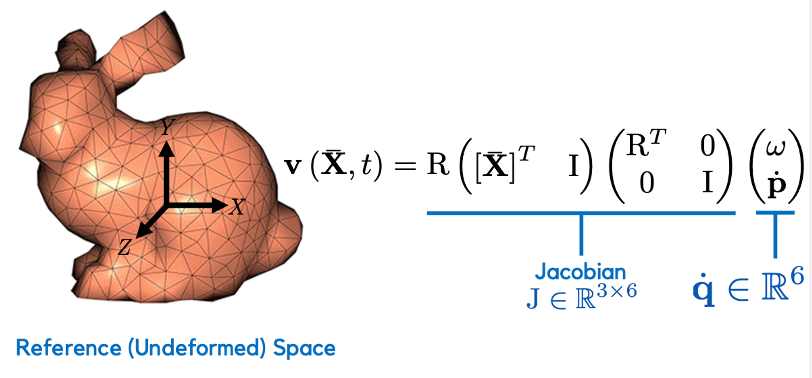
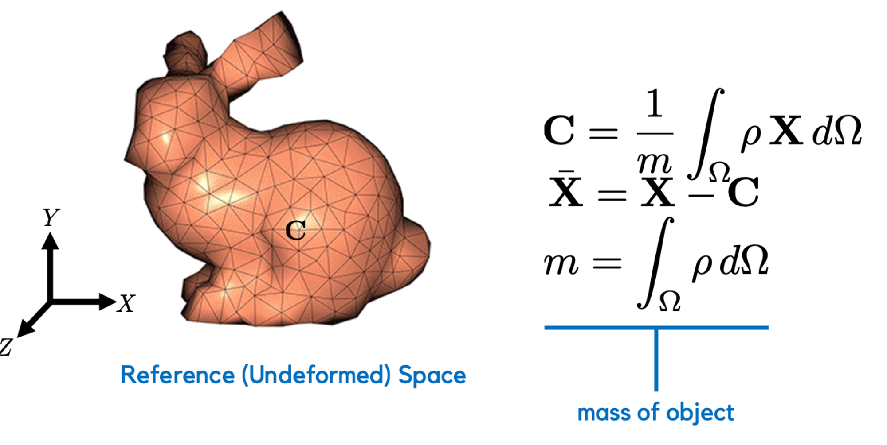
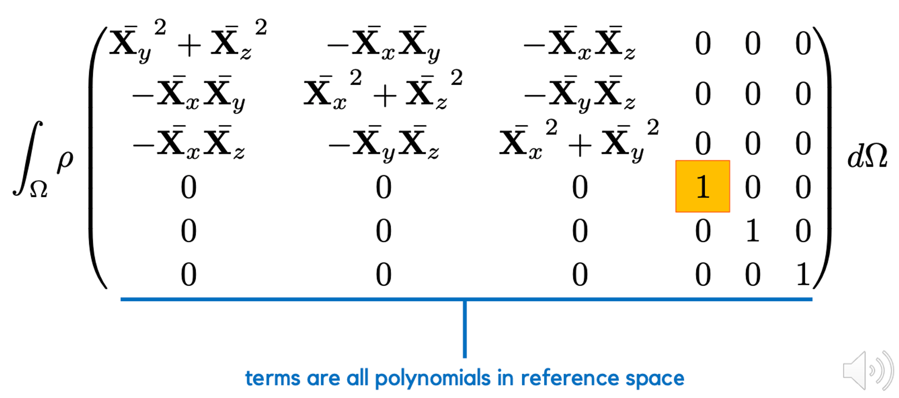
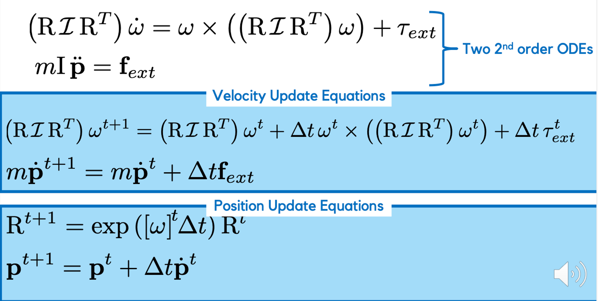

## Rigid Body

## Assignment Implementation

In this assignment you will implement everything needed to **simulate an unconstrained rigid body in free space**. This includes **the mass matrix integration and the explicit, exponential Euler time integrator**. While you are encouraged to consult any linked resources, **DO NOT** use any available source code in your assignment. You must code everything yourself.

### Implementation Notes

Because the generalized coordinates are no longer just a stacked vector of points, accessing them becomes trickier. To make this a little easier we will use the `[Eigen::Map](https://eigen.tuxfamily.org/dox/classEigen_1_1Map.html)` functionality. This let's you **create a proxy linear algebra operator from a raw chunk of memory**. In this assignment, **the rotation matrix and position vector representing a rigid bodies configuration are flattened out and stored in a single _Eigen VectorXd_.** To extract the rotation matrix from the rigid body indexed by `irb` you should do the following

`Eigen::Matrix3d R = Eigen::Map<const Eigen::Matrix3d>(q.segment<9>(12*irb).data());`

Note that I am using the templated version of the segment method, where the segment size is inside the `<>`.

### rodrigues.cpp

The rodrigues formula for computing the matrix exponential of a $3\times 3$, skew-symmetric matrix.

$$
\mathbf K = \begin{bmatrix}
0 & -k_z & k_y \\
k_z & 0 & -k_x \\
-k_y & k_x & 0
\end{bmatrix}
$$

$$
\mathbf R = \mathbf I +\sin \theta \mathbf K + (1 - \cos \theta)\mathbf K^2
$$

```cpp
void rodrigues(Eigen::Matrix3d &R, Eigen::Ref<const Eigen::Vector3d> omega)
{
    // Assumption: omega is pre-multiplied with dt
    Eigen::Vector3d axis = omega.normalized();
    Eigen::Matrix3d cross_axis;
    cross_axis << 0, -axis.z(), axis.y(),
        axis.z(), 0, -axis.x(),
        -axis.y(), axis.x(), 0;
    double theta = omega.norm();

    R = Eigen::Matrix3d::Identity() + std::sin(theta) * cross_axis + (1 - std::cos(theta)) * cross_axis * cross_axis;
}
```

### rigid_to_world.cpp

The rigid transformation from the undeformed space to the world (deformed) space.

$$
\mathbf x = \mathbf R \mathbf X + \mathbf p
$$

```cpp
void rigid_to_world(
    Eigen::Vector3d &x,
    Eigen::Ref<const Eigen::Matrix3d> R,
    Eigen::Ref<const Eigen::Vector3d> p,
    Eigen::Ref<const Eigen::Vector3d> X)
{

    x = R * X + p;
}
```

### rigid_body_jacobian.cpp

The Jacobian of the rigid-to-world transform.



```cpp
void rigid_body_jacobian(
    Eigen::Matrix36d &J,
    Eigen::Ref<const Eigen::Matrix3d> R,
    Eigen::Ref<const Eigen::Vector3d> p,
    Eigen::Ref<const Eigen::Vector3d> X)
{

    Eigen::Matrix3d cross_X;
    cross_X << 0, -X.z(), X.y(),
        X.z(), 0, -X.x(),
        -X.y(), X.x(), 0;

    // temp1 = | [X]^T   I |
    Eigen::Matrix36d temp1;
    temp1 << cross_X.transpose(), Eigen::Matrix3d::Identity();

    //         | R^T  0 |
    // temp2 = |        |
    //         |  0  I|
    Eigen::Matrix66d temp2;
    temp2.setZero();
    temp2.block<3, 3>(0, 0) = R.transpose();
    temp2.block<3, 3>(3, 3) = Eigen::Matrix3d::Identity();

    J = R * temp1 * temp2;
}
```

### inertia_matrix.cpp ❓

Compute the rigid inertia matrix of a 3d object, represented by a surface mesh, via surface only integration.




```cpp
// compute inertia matrix and volume by integrating on surfaces
void inertia_matrix(
    Eigen::Matrix3d &I,
    Eigen::Vector3d &center,
    double &mass,
    Eigen::Ref<const Eigen::MatrixXd> V,
    Eigen::Ref<const Eigen::MatrixXi> F,
    double density)
{

    I.setZero();
    center.setZero();
    mass = 0;

    Eigen::VectorXd A;
    igl::doublearea(V, F, A);

    // iteration for getting mass and center of mass
    Eigen::Vector3d X0, X1, X2, N;
    Eigen::Array3d X0_a, X1_a, X2_a;
    for (int i = 0; i < F.rows(); i++)
    {
        X0 = V.row(F(i, 0)).transpose();
        X1 = V.row(F(i, 1)).transpose();
        X2 = V.row(F(i, 2)).transpose();

        // for element wise computation
        X0_a = X0.array();
        X1_a = X1.array();
        X2_a = X2.array();

        N = ((X1 - X0).cross(X2 - X0)).normalized();
        // Barycentric integration over surface for X_x * N_x can be rewritten to the following and taking out constant N_x
        // N_x * 2 * Area * [sigma{0 to 1} sigma{0 to 1-phi1} X0_x * phi0 + X1_x * phi1 + X2_x * phi2 dphi2 dphi1]
        // which evaluates to (x0 + x1 + x2)/3 * A * N_x (note that A is just the area here)
        mass += (X0.x() + X1.x() + X2.x()) * N.x() * A(i);                                                                                 // A here is double area, and density and quotient will be multipled at the end
        center += ((X0_a.square() + X0_a * X1_a + X0_a * X2_a + X1_a.square() + X1_a * X2_a + X2_a.square()) * N.array()).matrix() * A(i); // Add density and quotient at the end
    }

    mass *= density / 6.0;
    center *= density / 24.0 / mass;

    // Shift over to center of mass coordinate
    Eigen::MatrixXd V_bar = V.rowwise() - center.transpose();
    // iteration 2 for [X_bar] * [X_bar]^T
    // will reuse X0, X1, X2, N again but now they all have a bar above them
    Eigen::Vector3d Xxyz2, Xxyz2Xyzx;   // translate to vector for [Xx^2 | Xy^2 | Xz^2] and [Xx^2 * Xy | Xy^2 * Xz |  Xz^2 * Xx]
    Eigen::Array3d X0csu, X1csu, X2csu; // They are the circular shifted up by 1 (|y z x| instead of |x y z|) equivalence of X0 X1 and X2
    for (int i = 0; i < F.rows(); i++)
    {
        X0 = V_bar.row(F(i, 0)).transpose();
        X1 = V_bar.row(F(i, 1)).transpose();
        X2 = V_bar.row(F(i, 2)).transpose();

        N = ((X1 - X0).cross(X2 - X0)).normalized();

        // for element wise computation
        X0_a = X0.array();
        X1_a = X1.array();
        X2_a = X2.array();
        X0csu << X0.y(), X0.z(), X0.x();
        X1csu << X1.y(), X1.z(), X1.x();
        X2csu << X2.y(), X2.z(), X2.x();

        // Will integrate several terms seperately and combine to form the inertia matrix
        // (X0^3 + X0^2*x1 + X0^2*X2 + X0*X1^2 + X0*X1*X2 + X0*X2^2 + X1^3 + X1^2*X2 + X1*X2^2 + X2^3) / 20 * 1/3 * 2 * A * N * rho [again, quotient and density will be added last]
        Xxyz2 = ((X0_a.pow(3) + X0_a.square() * X1_a + X0_a.square() * X2_a + X0_a * X1_a.square() + X0_a * X1_a * X2_a + X0_a * X2_a.square() + X1_a.pow(3) + X1_a.square() * X2_a + X1_a * X2_a.square() + X2_a.pow(3)) * N.array()).matrix() * A(i);

        // (3*x0_x^2*x0_y + x0_y*x1_x^2 + x0_x^2*x1_y + x0_y*x2_x^2 + x0_x^2*x2_y + 3*x1_x^2*x1_y + x1_y*x2_x^2 + x1_x^2*x2_y + 3*x2_x^2*x2_y + 2*x0_x*x0_y*x1_x + 2*x0_x*x0_y*x2_x + 2*x0_x*x1_x*x1_y + x0_x*x1_x*x2_y + x0_x*x1_y*x2_x + x0_y*x1_x*x2_x + 2*x0_x*x2_x*x2_y + 2*x1_x*x1_y*x2_x + 2*x1_x*x2_x*x2_y) / 60 / 2 * 2 * A * N * rho
        // just like terms above, quotient and density will be added last
        Xxyz2Xyzx = ((3 * X0_a.square() * X0csu + X0csu * X1_a.square() + X0_a.square() * X1csu + X0csu * X2_a.square() + X0_a.square() * X2csu + 3 * X1_a.square() * X1csu + X1csu * X2_a.square() + X1_a.square() * X2csu + 3 * X2_a.square() * X2csu + 2 * X0_a * X0csu * X1_a + 2 * X0_a * X0csu * X2_a + 2 * X0_a * X1_a * X1csu + X0_a * X1_a * X2csu + X0_a * X1csu * X2_a + X0csu * X1_a * X2_a + 2 * X0_a * X2_a * X2csu + 2 * X1_a * X1csu * X2_a + 2 * X1_a * X2_a * X2csu) * N.array()).matrix() * A(i);

        // Now we have all the needed terms. Time to combine!
        // Xy^2+Xz^2    -XxXy      -XxXz
        //  -XxXy     Xx^2+Xz^2    -XyXz
        //  -XxXz       -XyXz    Xx^2+Xy^2
        I(0, 0) += Xxyz2(1) + Xxyz2(2);
        I(1, 1) += Xxyz2(0) + Xxyz2(2);
        I(2, 2) += Xxyz2(0) + Xxyz2(1);

        I(0, 1) -= Xxyz2Xyzx(0);
        I(1, 0) -= Xxyz2Xyzx(0);

        I(0, 2) -= Xxyz2Xyzx(2);
        I(2, 0) -= Xxyz2Xyzx(2);

        I(1, 2) -= Xxyz2Xyzx(1);
        I(2, 1) -= Xxyz2Xyzx(1);
    }

    // quotient for diagonal entry
    I.diagonal() *= density / 60.0;
    // quotient for off-diagonal entry
    I(0, 1) *= density / 120.0;
    I(1, 0) *= density / 120.0;
    I(0, 2) *= density / 120.0;
    I(2, 0) *= density / 120.0;
    I(1, 2) *= density / 120.0;
    I(2, 1) *= density / 120.0;
}
```

### pick_nearest_vertices.cpp

**Use your code from the previous assignments**

### dV_spring_particle_particle_dq.cpp

**Use your code from the previous assignments**

### exponential_euler.h

Implement the explicit, exponential Euler time integration scheme.



```cpp
/**
 * Input:
 * @prams: q - 12n vector where n is the number of rigid bodies. Each rigid body is stored as 12 doubles.
 * @prams:     The first 9 doubles are the columns of a 3x3 rotation matrix and the final 3 doubles are the world space position of the object's center of mass.
 * @prams: qdot - 6n vector of generalied velocities. The first 3 doubles of each body are the world space angular velocity and
 * @prams:        the second 3 are the world space linear velocity.
 * @prams: dt - the integration time step
 * @prams: masses - a vector to mass matrices for each rigid body
 * @prams: forces - a 6n vector of generalized forces for n rigid bodies. The first 3 doubles of each rigid body are the torques acting on the object
 * @prams:          while the second 3 doubles are the linear forces.
 * Output:
 * @prams: q - updated generalized coordinates
 * @prams: qdot - updated generalized velocities
 */
inline void exponential_euler(
    Eigen::VectorXd &q,
    Eigen::VectorXd &qdot,
    double dt,
    std::vector<Eigen::Matrix66d> &masses,
    Eigen::Ref<const Eigen::VectorXd> forces)
{
    for (int i = 0; i < qdot.size() / 6; i++)
    {
        // Get all the current parameters
        Eigen::Matrix3d R = Eigen::Map<const Eigen::Matrix3d>(q.segment<9>(12 * i).data());
        Eigen::Vector3d p = q.segment<3>(12 * i + 9);
        Eigen::Vector3d omega = qdot.segment<3>(6 * i);
        Eigen::Vector3d pdot = qdot.segment<3>(6 * i + 3);
        Eigen::Matrix3d I = masses[i].block<3, 3>(0, 0);
        double mass = masses[i](3, 3);
        Eigen::Vector3d t_torq = forces.segment<3>(6 * i);
        Eigen::Vector3d f_ext = forces.segment<3>(6 * i + 3);

        Eigen::Matrix3d update_rotation, R_next_t;
        rodrigues(update_rotation, omega * dt);
        R_next_t = update_rotation * R;
        q.segment<9>(12 * i) = Eigen::Map<const Eigen::Vector9d>(R_next_t.data());
        q.segment<3>(12 * i + 9) = p + dt * pdot;

        qdot.segment<3>(6 * i) = (R * I * R.transpose()).inverse() * ((R * I * R.transpose()) * omega - dt * omega.cross((R * I * R.transpose()) * omega) + dt * t_torq);
        qdot.segment<3>(6 * i + 3) = (mass * pdot + dt * f_ext) / mass;
    }
}
```
